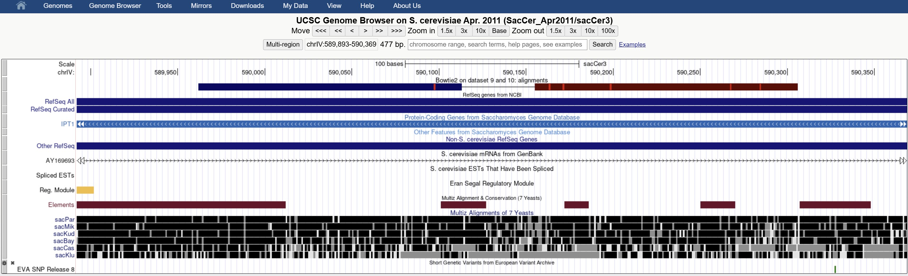
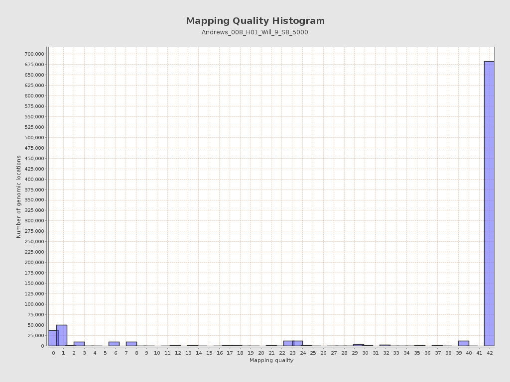
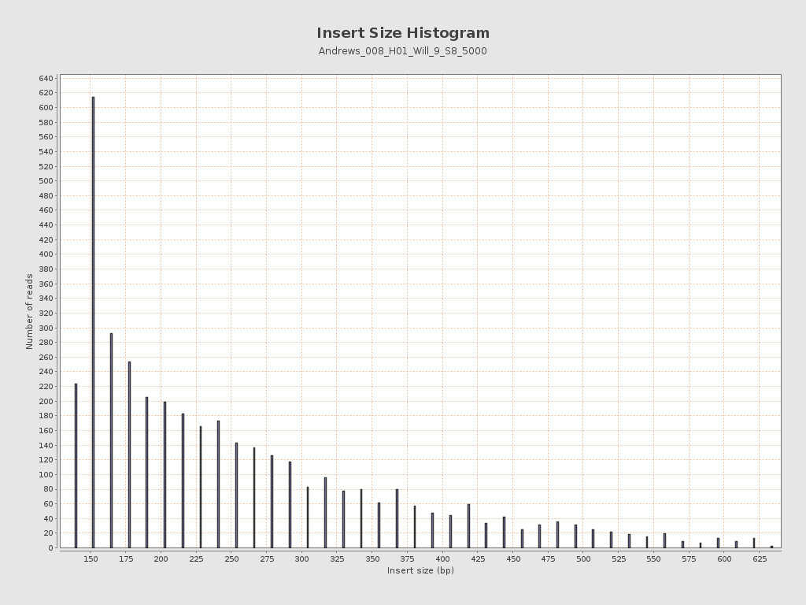

# MGY360 Dry Lab Notebook

**MGY360H1S** Whole-Genome Sequencing and Analysis (Winter 2026) | **Part 2:** Dry Lab & Bioinformatics

**Will Li** ([/williamli9300](https://github.com/williamli9300))

----
# Contents
- [**Laboratory 1:** Quality Control & Alignment](#lab1)
- [**Laboratory 2:** Viewing the Alignments](#lab2)
- [**Laboratory 3:** Calling Variants & Initial Prioritization](#lab3)
- [**Laboratory 4:** Identifying a Causative Variant](#lab4)
- [**Appendices**](#appx)
  - [Appendix 1.1. Sequence Files](#appx1.1)
  - [Appendix 1.2. FastQC Reports](#appx1.2)
  - [Appendix 2.1. QualiMap BamQC Report (Downsampled Data)](#appx2.1)
  - [Appendix 2.2. QualiMap BamQC Report (Entire Data)](#appx2.2)
  - [Appendix 3.1. Variant Report](#appx3.1)

<br>

----
# Laboratory 1: Quality Control & Alignment <a name="lab1"></a>

## 1.1 Galaxy
In this lab, the **Galaxy**<sup>[1](#r1.1)</sup> ([https://usegalaxy.org/](https://usegalaxy.org/)) platform was used.

## 1.2 Uploading Sequences
Two sequences prepared from *S. cerevisiae* samples and sequenced via paired-end Illumina NextSeq 2000 sequencing [Appendix 1.1](#appx1.1 "Appendix 1.1. Sequence Files"), downsampled to 5000 reads:

- `Andrews_008_H01_Will_9_S8_R1_5000.fastq` corresponds with the [**forward**](# "Andrews_008_H01_Will_9_S8_R1_5000.fastq") read.
- `Andrews_008_H01_Will_9_S8_R2_5000.fastq` corresponds with the [**reverse**](# "Andrews_008_H01_Will_9_S8_R2_5000.fastq") read.

Sequences were uploaded to **Galaxy**, using the `S. cerevisae str. S288C (Saccharomyces_cerevisiae_S288C_SGD2010)` reference genome.

## 1.3 Initial Quality Inspection

The first 10 quality scores in both the [**forward**](# "Andrews_008_H01_Will_9_S8_R1_5000.fastq") *and* [**reverse**](# "Andrews_008_H01_Will_9_S8_R2_5000.fastq") reads were:

```
IIIIIIIIII
```

indicating that the first 10 nucleotide reads for each were assigned a Phred score of $Q40$, suggesting good quality reads.

## 1.4 Quality Inspection & `FastQC`

*FastQC Read Quality Reports ([Appendix 1.2](#appx1.2 "Appendix 1.2. FastQC Reports Forward and Reverse Reads")) generated using **FastQC**<sup>[2](#r1.2)</sup>**, Galaxy version 0.74+galaxy1**.*

### 1.4.1 FastQC Report for Forward Read

The FastQC report for the [**forward**](# "Andrews_008_H01_Will_9_S8_R1_5000.fastq") read returned a total of **755 kbp**, over **5000** total sequences of length **151**. The GC content was **40%**.

One [**$!$ Warning**] was thrown for **per sequence GC count**, indicating a deviation of between 15-30% from the theoretical distribution<sup>[3](#r1.3)</sup>. The peak of the actual distribution appeared to remain ±1.5 percent mean GC content from the theoretical distribution; the shape of the actual distribution curve appears slightly left skewed compared to the theoretical distribution.

Two [**$\times$ Error**]s were thrown, for **per base sequence content** and **adapter content**. The first indicates a >20% difference in A/T or G/C base ratios at at least one position<sup>[3](#r1.3)</sup>. Visual inspection of the Sequence Content vs. Position graph reveals highly variable sequence content at the first 10-15 bases. This is likely the result of potential nucleotide bias arising from random priming<sup>[4](#r1.4)</sup>. For the second, a visual inspection of the % Adapter vs. Position graph reveals cumulatively, around 25% of Nextera Transposase Sequence was observed by the last position of each read (with adapter observed starting around bases 45-49), as well as up to around 5% poly-guanine tracts. beginning at positions 95-99<sup>[3](#r1.3)</sup>. Both suggest the presence of inserts shorter than the read length, resulting in read-through into adapter sequences, or potentially the calling of calling of dark signal (i.e., no signal) as `G` even after termination of synthesis<sup>[5](#r1.5)</sup>.

### 1.4.2 FastQC Report for Reverse Read

The FastQC report for the Reverse read had the same one [**$!$ Warning**] and two [**$\times$ Error**]s as the report for the Forward read. These were assessed to be caused by the same factors as in the Forward read.

There was additionally one [**$!$ Warning**] for **per tile sequence quality**, where one standout tile around read 2202-2203 and around position 30-34 was indicated orange for poor quality<sup>[3](#r1.3)</sup>, and one other [**$!$ Warning**] for **overrepresented sequences**, which counted eleven poly-G tracts fifty `G`s long, likely arising for the same reason as mentioned in 1.4.1.

### 1.4.3 Characterization of Reads from FastQC Reports

Across both reports, quality per base was generally very good, with average quality always at 36 or higher or 38 or higher for the forward and reverse reads, respectively. In the forward read, the lower whisker began to fall into the orange zone (passable quality) around read 115-119, while in the reverse read the lower whisker always remained in the green zone. This terminal quality decay is expected and attributable to accumulation of error and noise or the presence of shorter-than-expected insert lengths. High adapter content is likely attributable to fragments shorter than the read length, likely due to overdigestion.

Both reports suggest, by visual inspection, a GC content of just under 40%, consistent with a known approximately 38% GC content in the reference genome<sup>[6](#r1.6)</sup>. 

Both sequences had an average quality score of 39. Given that quality score $Q$ is given by:

$$Q = -10 log_{10}(P)$$

we know that:

$$P = 10^{-\frac{Q}{10}}$$

so, given a Phred score of $Q39$, we get a $P = 10^{-3.9} = 0.0126\%$ expected rate of incorrect base calls. Given a read length of 151, we expect around **0.019** incorrect base calls per read, and around **19000** incorrect base calls per million reads (126 incorrect base calls per million base calls). As expected, since both forward and reverse libraries were prepared from the same library, the quality and adapter content across the two sequence files are similar.

## 1.5 Sequence Alignment with Reference Genome

*Sequence Alignment performed using **Bowtie2**<sup>[7](#r1.7)</sup>**, Galaxy version 2.5.4+galaxy0**.*

Bowtie2 paired library alignment run with default settings, except maximum fragment length set to **800**, using the `sacCer3` reference genome index.

<details>
<summary><b>Bowtie2 Command Line</b> (<i>click to expand</i>)</summary>

```
set -o | grep -q pipefail && set -o pipefail;   ln -f -s '/corral4/main/objects/0/c/0/dataset_0c0c670a-7c7f-4e6b-822c-70792f762c3f.dat' input_f.fastq.gz &&  ln -f -s '/corral4/main/objects/e/0/1/dataset_e010227a-2b32-4ae9-9df1-3fbd6c1a31e4.dat' input_r.fastq.gz &&   THREADS=${GALAXY_SLOTS:-4} && if [ "$THREADS" -gt 1 ]; then (( THREADS-- )); fi &&   bowtie2  -p "$THREADS"  -x '/cvmfs/data.galaxyproject.org/managed/bowtie2_index/sacCer3/sacCer3'   -1 'input_f.fastq.gz' -2 'input_r.fastq.gz' -I 0 -X 800 --fr                     2> >(tee '/corral4/main/jobs/075/048/75048950/outputs/dataset_e7fc3948-60d2-4b1e-8730-c22aefb3182c.dat' >&2)  | samtools sort -l 0 -T "${TMPDIR:-.}" -O bam | samtools view --no-PG -O bam -@ ${GALAXY_SLOTS:-1} -o '/corral4/main/jobs/075/048/75048950/outputs/dataset_527fa994-cf90-41c0-8dd6-6cff1b68df19.dat'
```

</details>

Bowtie2 defaults to the `--sensitive` flag, meaning sensitive alignment in end-to-end alignment mode (`--end-to-end`). Local alignment allows alignment of substrings within a sequence to the reference genome, whereas end-to-end alignment prioritizes alignment of the entire sequence; this results in slightly different alignment score calculation. Sensitivity options (e.g. `--fast`, `--sensitive`) modulate `-D`, `-R`, `-N`, `-L`, and  `-i` flag arguments, which affect the number of allowed consecutive failed seed extension attempts, maximum number of allowed reseeding attempts, mismatches allowed during seed alignment, length of seed substrings, and interval between seed substrings, respectively<sup>[8](#r1.8)</sup>. Local alignment helpful when searching for local homology (e.g. conserved domains over several different sequences). More sensitive values increase runtime but increase sensitivity for alignment, which allows less perfect matches to be accepted and revealed (e.g., when matching a sequence with low, e.g. <70%, homology to any known reference sequence). 

Our sequences are expected to match the reference sequence with high homology (genetically very close to the reference genome) across the entire genome (whole genome sequencing and alignment), so in theory increasing sensitivity or enabling local alignment options would not be necessary be beneficial, regardless of how much compute power we have access to. It may be helpful to use local alignment to better discard adapter sequences, or increase sensitivity to find more alignment matches.

<details open>
<summary><b>Bowtie2 Standard Error</b> (<i>click to collapse</i>)</summary>

```
5000 reads; of these:
  5000 (100.00%) were paired; of these:
    1652 (33.04%) aligned concordantly 0 times
    2947 (58.94%) aligned concordantly exactly 1 time
    401 (8.02%) aligned concordantly >1 times
    ----
    1652 pairs aligned concordantly 0 times; of these:
      548 (33.17%) aligned discordantly 1 time
    ----
    1104 pairs aligned 0 times concordantly or discordantly; of these:
      2208 mates make up the pairs; of these:
        2013 (91.17%) aligned 0 times
        83 (3.76%) aligned exactly 1 time
        112 (5.07%) aligned >1 times
79.87% overall alignment rate
```

**66.96%** of reads were aligned at least once concordantly, and **10.96%** were aligned discordantly; a further **1.95%** of reads were mates that aligned at least once. The final overall alignment rate was **79.87%**. Concordant alignments satisfy both the upstream/downstream mate orientation requirements (`-fr`, `-rf`, `-ff`) as well as minimum and maximum fragment sizes (`-I`, `-X`); discordant alignments are alignments that do not meet all these requirements. An overall alignment of roughly ~80% is seems fairly acceptable for a first-pass alignment using downsampled data. Increasing sensitivity options may increase the overall alignment, but given the present experiment it is not likely to increase by much without changing the dataset (using the `--very-sensitive` flag only increased the overall alignment to 79.90%.)

</details>

## References

1. <a name="r1.1"></a> The Galaxy Community. The Galaxy platform for accessible, reproducible, and collaborative data analyses: 2024 update, *Nucleic Acids Res.* **52**, W83–W94 (2024). doi: [10.1093/nar/gkae410](https://doi.org/10.1093/nar/gkae410).
   
2. <a name="r1.2"></a> Andrews, S. FastQC:  A Quality Control Tool for High Throughput Sequence Data [Online]. (2010) [http://www.bioinformatics.babraham.ac.uk/projects/fastqc/](http://www.bioinformatics.babraham.ac.uk/projects/fastqc/).
   
3. <a name="r1.3"></a> Quality control: How do you read your FASTQC results? *CD Genomics Bioinformatics Analysis*. [https://bioinfo.cd-genomics.com/](https://bioinfo.cd-genomics.com/).
   
4. <a name="r1.4"></a> Hansen, K.D., Brenner, S.E., & Dudoit, S. Biases in Illumina transcriptome sequencing caused by random hexamer priming. *Nucleic Acids Res.* **38**, e131 (2010). doi: [10.1093/nar/gkq224](https://doi.org/10.1093/nar/gkq224).
   
5. <a name="r1.5"></a> Read Trimming. *Illumina DRAGEN Bio-IT Platform v4.0*. [https://support-docs.illumina.com/SW/DRAGEN_v40/Content/SW/DRAGEN/ReadTrimming.htm](https://support-docs.illumina.com/SW/DRAGEN_v40/Content/SW/DRAGEN/ReadTrimming.htm).

6. <a name="r1.6"></a> Wang, D. & Gao, F. Comprehensive analysis of replication origins in *Saccharomyces cerevisiae* genomes. *Front. Microbiol.* **10**, 2122 (2019). doi: [10.3389/fmicb.2019.02122](https://doi.org/10.3389/fmicb.2019.02122).

7. <a name="r1.7"></a> Langmead, B., Trapnell, C., Pop, M., & Salzberg, S. L. Ultrafast and memory-efficient alignment of short DNA sequences to the human genome. *Genome Bio.*, **10**, R25 (2009). doi: [10.1186/gb-2009-10-3-r25](https://doi.org/10.1186/gb-2009-10-3-r25).

8. <a name="r1.8"></a> Bowtie 2: Manual. *Bowtie (Sourceforge)*. [https://bowtie-bio.sourceforge.net/bowtie2/manual.shtml](https://bowtie-bio.sourceforge.net/bowtie2/manual.shtml)

<br>

----
# Laboratory 2: Viewing the Alignments <a name="lab2"></a>

## 2.1 Visualizing Bowtie2 Alignment in UCSC Genome Viewer



Bowtie2 alignments were visualized in the UCSC Genome Browser<sup>[1](#r2.1)</sup>. Blue strands correspond with with positive (+) strands, whereas dark red strands correspond with negative (–) strands. Single horizontal lines indicate non-overlapping distance between the forward and reverse reads of a paired-end read. Bright red lines within the reads indicate mismatches between the query sequence and the reference sequence.

Five alignments, across various chromosomes, with a variety of Alignment Quality scores were selected for inspection:

| Paired Read Name                        | Chromosomal Position (L/R) | Left-End Alignment Quality | Right-End Alignment Quality | Note |
|-----------------------------------------|:--------------------------:|:--------------------------:|:-----------------------------:|---|
|`VH02249:15:AAHYGTMM5:1:2102:65721:15918` |`chrI:184846-184996` <br> `chrI:184902-185052`   | 42 | 42 |
|`VH02249:15:AAHYGTMM5:1:1304:40462:22582` |`chrIV:7914-8064` <br> `chrIV:8312-8462`   | 1 | 1 |
|`VH02249:15:AAHYGTMM5:1:2402:35311:29966` |`chrIX:292008-292158` <br> `chrIX:292287-292437`   | 42 | 42 |
|`VH02249:15:AAHYGTMM5:1:1102:58886:52665`|`chrXVI:831122-831264` <br> `chrXVI:831128-831270`   | 23 | 23 | Not properly paired |
|`VH02249:15:AAHYGTMM5:1:1402:28059:10561`|`chrXII:22481-22621` <br> `n/a`| 0 | `n/a` | Unmapped; Not properly paired |

*QualiMap BamQC Report ([Appendix 2.1](#appx1.2 "Appendix 2.1. QualiMap BamQC Report for Downsampled Data")) was generated using **QualiMap BamQC**<sup>[2](#r2.2)</sup>**, Galaxy Version 2.3+galaxy0**.* 

## 2.2 Alignment Quality (Downsampled Dataset)

The QualiMap BamQC Report was used to summarize mapping quality, and returned a Mean Mapping Quality of **34.76**. Based on this data, a stringent cut-off of 35-38 for high-quality/properly mapped scores would seem reasonable.



Mean insert size was **262.41±116.27 bp** (mean ± SD). The insert size distribution was highly right-skewed, with a histogram peak of >600 reads appearing at a size of **150 bp**. The median insert size was 227. These are consistent, if not a bit smaller than, the expected insert size of ~200-600 bp for ~150 bp reads. 



The coverage for the downsampled dataset was **0.0985±0.4004**. 

## 2.3 Alignment Quality (Raw Dataset)

Mean mapping quality for the raw (non-downsampled dataset) ([Appendix 2.1](#appx1.2 "Appendix 2.1. QualiMap BamQC Report for Downsampled Data")) dataset was **38.83**, higher than in the downsampled dataset. Mean insert size was **256.23±111.47** (mean ± sd), similar to the downsampled dataset, with an apparently higher proportion of inserts ≥ 150 bp. The coverage for the raw was **99.0035±123.2162**, with most genomic locations exhibiting a mean coverage of at least 50%.


### 2.3.1 Genome Coverage

Genome coverage is given by:

$$
\frac{N \times L}{G}
$$

where $N$ is equal to the number of aligned reads, $L$ is equal to the read length, and $G$ is equal to the size of the genome. Given the length of the *S. cerevisiae* S288C reference genome is approximately 12.1 Mb<sup>[3](#r2.3),[4](#r2.4)</sup>, theoretical mean whole-genome coverage at 2 $\times$ 10 $^{4}$ reads would be given by $\frac{20~000\times151}{12.1\times10^6} = 0.25$.

## References

1. <a name="r2.1"></a> Casper, J. *et al.* The UCSC Genome Browser database: 2026 update. *Nucleic Acids Res.* **6**, D1331–D1335 (2026). doi: [10.1093/nar/gkaf1250](https://doi.org/10.1093/nar/gkaf1250/).

2. <a name="r2.2"></a> Okonechnikov, K., Conesa, A., & García-Alcalde, F. Qualimap 2: advanced multi-sample quality control for high-throughput sequencing data. *Bioinformatics* **32**, 292–294 (2015). doi: [10.1093/bioinformatics/btv566](https://doi.org/10.1093/bioinformatics/btv566).

3. <a name="r2.3"></a> Goffeau, A. *et al.* Life with 6000 genes. *Science* **274**, 563–567 (1996). doi: [10.1126/science.274.5287.546](https://doi.org/10.1126/science.274.5287.546).

4. <a name="r2.4"></a> Saccharomyces cerevisiae S288C genome assembly R64. *Genome - NCBI - NLM*. [https://www.ncbi.nlm.nih.gov/datasets/genome/GCF_000146045.2/](https://www.ncbi.nlm.nih.gov/datasets/genome/GCF_000146045.2/).

<br>

----
# Laboratory 3: Calling Variants & Initial Prioritization <a name="lab3"></a>

## 3.1 Initial Variant Calling

*Variant Calling performed using **bcftools mpileup** and **call**<sup>[1](#r3.1)</sup>**, Galaxy Version 1.22+galaxy0**.* 

Default minimum mapping quality for a base to be considered is (`-q`, `--min-MQ`) is **0**, and default minimum base quality for a base to be considered (`-Q`, `--min-BQ`) is **13**.

**bcftools call** information abbreviations:
- **DP:** depth — read depth at a given site.
- **AC:** allele count — number of copies of given allele.
- **MQ:** mapping quality — confidence that a read is correct ($-10log_{10}(P)$, where $P$ is the probability that a read is wrong.)
- **QUAL**: variant call quality — confidence that the call is not attributable to chance ($-10log_{10}(P)$, where $P$ is the probability of observing the call by pure chance.) 


## 3.2 Variant Filtering

Variant filtering was done manually in Microsoft Excel ([Appendix 3.1](#appx3.1)).

**196** positions with variants specific to the mutant (MUT) strain were identified, whereas **2976** positions with variants specific to the parental (PAR) strain were identified. **324** positions were identified with variants in both strains.

Variants specific to the parental (PAR) strain are likely due to spontaneous 

For example, a variant at `chrII:719,805` was specific to only the MUT strain. This was identified as a potentially plausible mutant from its QUAL score of `225.41`, and verified as likely by viewing in the UCSC Genome Browser, where all samples of the MUT BAM (at a depth of 75) showed a C nucleotide, whereas both the reference genome and all but two reads of the fks1 S7 PAR sample showed a G nucleotide. 

## References

1. <a name="r3.1"></a> Li, H. *et al.* The Sequence Alignment/Map format and SAMtools. *Bioinformatics* **25**, 2078–2079 (2009). doi: [10.1093/bioinformatics/btp352](https://doi.org/10.1093/bioinformatics/btp352).

2. <a name="r3.2"></a> bcftools(1) Manual Page. [https://www.htslib.org/doc/bcftools.html](https://www.htslib.org/doc/bcftools.html).

----
# Laboratory 4: Identifying a Causative Variant<a name="lab4"></a>

## 4.1 Further Variant Filtering

Variant filtering was done manually in Microsoft Excel ([Appendix 3.1](#appx3.1)).

Across all non-indel variants, most variants with `QUAL` > 100 had `DP` > 10 (with some 8-9) and `MQ` > 30 (with some 22-28); most variants with `QUAL` < 10 had `DP` < 10 (with some large `DP` values); many had large `MQ` values. For `MUT`-only non-indel variants, all variants with `QUAL` > 100 had `DP` > 50 and `MQ` > 20; all variants with `QUAL` < 10 had `DP` ≤ 3 despite `MQ` > 30.

The four variants with the highest `QUAL` scores (the only four > 100) were at `chrII:719805`, `chrVII:550402`, `chrXVI:833465`, and `chrIV:1524263` (225.417, 225.417, 225.417, and 165.416). The variant with the lowest `QUAL` score was `chrIX:257` (3.22451).

`chrIX:257` had 3/47 forward strand and 2/40 reverse strand reads were called as `G`, versus 4/395 forward and 3/418 reverse strand reads called `G` in the reference genome (with an additional 6/418 reverse strands called `A`). (The reference base is `T`).

`chrVII:550402` had 46/46 forward and 43/43 reeverse called as `C`, while 243/244 forward and all 248 reverse strand reads were called as the reference `G` (one forward read was called as `T`).


The top 9 variants by `QUAL` score (>50) were: 

| Position         | REF  | ALT | PAR   | QUAL   | GENE/FEATURE | VAR READS |
|------------------|------|-----|-------|--------|--------------|-----------|
| `chrII:719805`   | `G`  | `C` | REF   | 225.42 | SPO23        | HOMO      |
| `chrVII:550402`  | `G`  | `C` | REF   | 225.42 | GSC2         | HOMO      |
| `chrXVI:833465`  | `T`  | `G` | REF   | 225.42 | US of URN1   | HOMO      |
| `chrIV:1524263`  | `T`  | `G` | `T/G` | 165.42 | n/a          | HOMO      |
| `chrXVI:853335`  | `T`  | `C` | REF   | 58.41  | YPR158C-D    | few reads |
| `chrX:293`       | `C`  | `T` | REF   | 53.41  | TEL10L       | few reads |
| `chrX:302`       | `C`  | `T` | REF   | 53.41  | TEL10L       | few reads |
| `chrX:312`       | `C`  | `T` | REF   | 53.41  | TEL10L       | few reads |
| `chrX:316`       | `G`  | `C` | REF   | 53.41  | TEL10L       | few reads |

Of these, two were classified as potentially affecting gene function by [Ensembl Variant Effect Predictor](https://www.ensembl.org/Tools/VEP?redirect=no)<sup>[1](#r4.1)</sup> based on *S. cerevisiae* assembly R64-1-1:

<details>
<summary>Ensembl format VEP query (<i>click to expand</i>)</summary>
<pre><code>II 719805 719805 C/G 1
VII 550402 550402 C/G 1
XVI 833465 833465 T/G 1
IV 1524263 1524263 T/G 1
XVI 853335 853335 T/C 1
X 293 293 C/T 1
X 302 302 C/T 1
X 312 312 C/T 1
X 316 316 G/C 1
</pre></code>
</details>

| Location        | Variant     | Consequence | Impact   | GENE    | Transcript     | Amino Acids | AA Position | Codons      | CDS Position | Strand | SIFT           |
|-----------------|:-----------:|:-----------:|:--------:|:-------:|:--------------:|:-----------:|:-----------:|:-----------:|:------------:|:------:|:--------------:|
| `chrII:719805`  | `G`>`C`     | Missense    | Moderate | `SPO23` | `YBR250W_mRNA` | `G`>`A`     | 258         | `gGc`>`gCc` | 773          | `+`    | deleterious(0) |
| `chrVII:550402` | `G`>`C`     | Missense    | Moderate | `GSC2`  | `YGR032W_mRNA` | `L`>`F`     | 713         | `ttG`>`ttC` | 2139         | `+`    | deleterious(0) |

## 4.2 Preliminary Literature Search
### 4.2.1 UniProt Entries:
1. P33757 - SPO23_YEAST. Uniprot. [https://www.uniprot.org/uniprotkb/P33757/entry](https://www.uniprot.org/uniprotkb/P33757/entry)
    - SP023 is a yeast sporulation protein.
2. P40989 - FKS2_YEAST. Uniprot. [https://www.uniprot.org/uniprotkb/P40989/entry](https://www.uniprot.org/uniprotkb/P40989/entry)
    - GSC2 is an alternate catalytic subunit of 1,3-β-glucan synthase.

### 4.2.2 Articles:  
1. Aggarwal, A. *et al.* Genome-wide Expression Profiling of the Response to Polyene, Pyrimidine, Azole, and Echinocandin Antifungal Agents in *Saccharomyces cerevisiae*. *J. Biol. Chem.* **278**, 34998–35015 (2003). doi: [10.1074/jbc.M306291200](https://doi.org/10.1074/jbc.M306291200).
    - *[Research] Gene expression profiling of* S. cerevisiae *in response to antifungal agents shows GSC1 (aka FKS1) is induced and GSC2, homologous to GSC1, is induced in* fks1Δ *cells.*
2. Douglas, C.M. *et al*. Identification of the FKS1 gene of Candida albicans as the essential target of 1,3-beta-D-glucan synthase inhibitors. *Antimicrob. Agents Chemother.* **41**, 2471–2479 (1997). doi: [10.1128/aac.41.11.2471](https://doi.org/10.1128/aac.41.11.2471).
    - *[Research] 1,3-β-ᴅ-glucan synthase, encoded by FKS1 (also known as GSC1) is the essential target of echinocandins (incl. caspofungin, micafungin) in* C. albicans.

3. Hector, R.F. Compounds active against cell walls of medically important fungi. *Clin. Microbiol. Rev.* **6**, 1–21 (1993). doi:[10.1128/cmr.6.1.1](https://doi.org/10.1128/cmr.6.1.1).
    - *[Review] Echinocandins inhibit glucan synthesis in* C. albicans *and* S. cerevisiae.

4. Gruner, J., Traxler, P. Papulacandin, a new antibiotic, active especially against yeasts. *Experientia* **33**, 137 (1977). [10.1007/BF01936812](https://doi.org/10.1007/BF01936812).
    - *[Report] Papulacandin, a novel echinocandin, shown to be active against* Candida albicans *through inhibition of structural glucan synthesis. (Cited in Hector 1993.)*
5. Mizoguchi, J. *et al.* On the mode of action of a new antifungal antibiotic, aculeacin A: inhibition of cell wall synthesis in Saccharomyces cerevisiae. *J. Antibiot. (Tokyo)*. **30**, 308-313 (1977). doi: [10.7164/antibiotics.30.308](https://doi.org/10.7164/antibiotics.30.308).
    - *[Research] Aculeacin, a novel echinocandin, shown to be active against* Saccharomyces cerevisiae *through inhibition of structural glucan synthesis. (Cited in Hector 1993.)*
6. Mio, T. *et al*. Cloning of the Candida albicans homolog of Saccharomyces cerevisiae GSC1/FKS1 and its involvement in beta-1,3-glucan synthesis. *J. Bacteriol.* **179**, 4096–4105 (1997). [10.1128/jb.179.13.4096-4105.1997](https://doi.org/10.1128/jb.179.13.4096-4105.1997).
    - *[Research] Cloning of the* Saccharomyces cerevisiae *homologue of the* Candida albicans *1,3-β-ᴅ-glucan synthase gene GSC1/FKS1.*
7.  Mazur, P. *et al.* Differential expression and function of two homologous subunits of yeast 1,3-beta-D-glucan synthase. *Mol Cell Biol.* **15**, 5671–5681 (1995). doi: [10.1128/MCB.15.10.5671](https://doi.org/10.1128/MCB.15.10.5671).
    - *[Research] FKS2/GSC2 is an alternative, differentially-regulated catalytic subunit of FKS1/GSC1 that restores 1,3-β-ᴅ-glucan synthase function in* fks1Δ *cells.*
8. Katiyar, S.K. *et al*. Fks1 and Fks2 are functionally redundant but differentially regulated in Candida glabrata: implications for echinocandin resistance. *Antimicrob. Agents Chemother.* **56**, 6304–6309 (2012). doi: [10.1128/AAC.00813-12](https://doi.org/10.1128/AAC.00813-12).
    - *[Research] FKS2 hotspot mutationns associated with* fks1Δ/fks3Δ *strains of* Candida *spp. yielded high-level resistance to echinocandins.*
9.  Accoceberry, I. *et al.* Challenging SNP impact on caspofungin resistance by full-length FKS1 allele replacement in *Candida lusitaniae*. *J. Antimicrob. Chemother.*, **74**, 618–624 (2019). doi: [10.1093/jac/dky475](https://doi.org/10.1093/jac/dky475).
    - *[Research] SNVs or small indels in the hotspot (HS) regions HS1 and HS2 confer reduced susceptibility or resistance to caspofungin in* C. albicans.

## References:
1.  <a name="r4.1"></a> McLaren, W. *et al.* The Ensembl Variant Effect Predictor. *Genome Biol.* **17**, 122 (2016). doi: [10.1186/s13059-016-0974-4](https://doi.org/10.1186/s13059-016-0974-4).

----
# Appendices <a name="appx"></a>

## Appendix 1.1. Sequence Files <a name="appx1.1"></a>

- `Andrews_008_H01_Will_9_S8_R1_5000.fastq`: [gzip](./fastq/Andrews_008_H01_Will_9_S8_R2_5000.fastq.gz)
- `Andrews_008_H01_Will_9_S8_R2_5000.fastq`: [gzip](./fastq/Andrews_008_H01_Will_9_S8_R2_5000.fastq.gz)

## Appendix 1.2. FastQC Reports for [Forward](# "Andrews_008_H01_Will_9_S8_R1_5000.fastq") and [Reverse](# "Andrews_008_H01_Will_9_S8_R2_5000.fastq") Reads <a name="appx1.2"></a>

- FastQC Reports for Downsampled Data Set
  - `Andrews_008_H01_Will_9_S8_R1_5000_FastQC.html`: [html](https://htmlpreview.github.io/?https://github.com/williamli9300/mgy360/blob/master/fastqc/Andrews_008_H01_Will_9_S8_R2_5000_FastQC.html)
  - `Andrews_008_H01_Will_9_S8_R2_5000_FastQC.html`: [html](https://htmlpreview.github.io/?https://github.com/williamli9300/mgy360/blob/master/fastqc/Andrews_008_H01_Will_9_S8_R2_5000_FastQC.html)
- FastQC Reports for Entire Data Set
  - `Andrews_008_H01_Will_9_S8_R1_001_fastqc.html`: [html](https://htmlpreview.github.io/?https://github.com/morganalford/MGY360_2026/blob/main/Output/FastQC/Andrews_008_H01_Will_9_S8_R1_001_fastqc.html)
  - `Andrews_008_H01_Will_9_S8_R1_001_fastqc.html`: [html](https://htmlpreview.github.io/?https://github.com/morganalford/MGY360_2026/blob/main/Output/FastQC/Andrews_008_H01_Will_9_S8_R2_001_fastqc.html)

## Appendix 2.1. QualiMap BamQC Report for Downsampled Data <a name="appx2.1"></a>
- `QualiMap_BamQC.html` : [html](https://htmlpreview.github.io/?https://github.com/williamli9300/mgy360/blob/master/qualimap-bamqc/QualiMap_BamQC.html)


## Appendix 2.2. QualiMap BamQC Report for Entire Data <a name="appx2.2"></a>
- `qualimapReport.html`: [html](https://htmlpreview.github.io/?https://github.com/morganalford/MGY360_2026/blob/main/Output/Qualimap/Andrews_008_H01_Will_9_S8_markdup_qualimap/qualimapReport.html)

## Appendix 3.1. Variant Report <a name="appx3.1"></a>
- `variants.xlsx`: [xlsx](./Variants.xlsx)